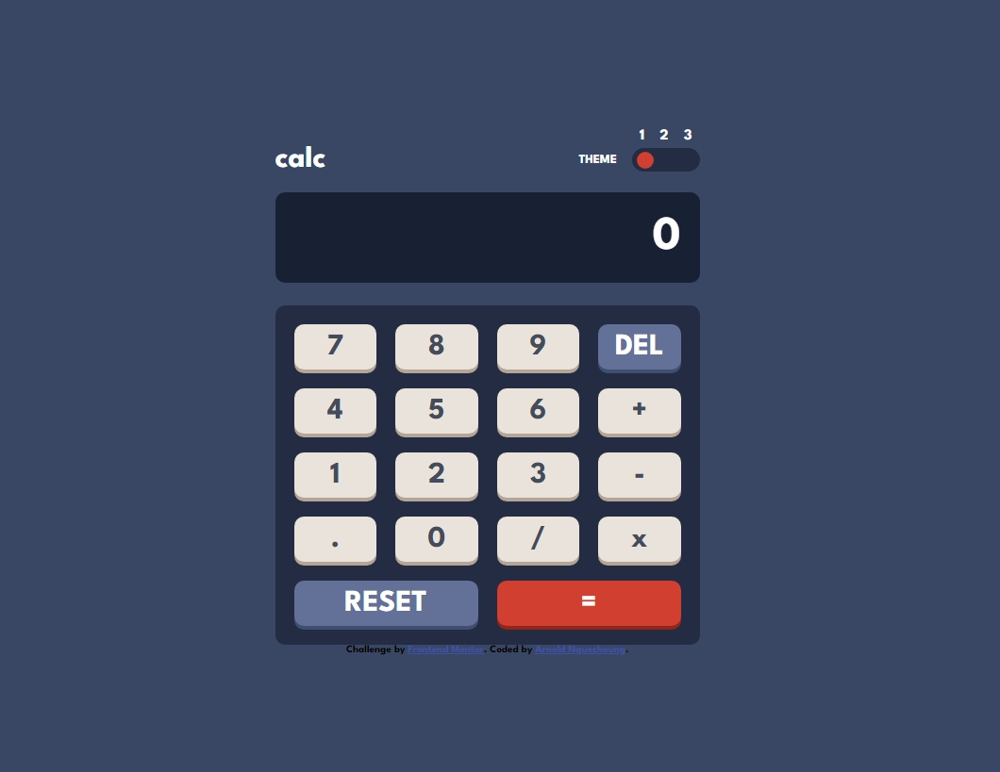

# Frontend Mentor - Calculator app solution

This is a solution to the [Calculator app challenge on Frontend Mentor](https://www.frontendmentor.io/challenges/calculator-app-9lteq5N29). Frontend Mentor challenges help you improve your coding skills by building realistic projects. 

## Table of contents

- [Overview](#overview)
  - [The challenge](#the-challenge)
  - [Screenshot](#screenshot)
  - [Links](#links)
- [My process](#my-process)
  - [Built with](#built-with)
  - [What I learned](#what-i-learned)
  - [Continued development](#continued-development)
- [Author](#author)
- [Acknowledgments](#acknowledgments)


## Overview

### The challenge

Users should be able to:

- See the size of the elements adjust based on their device's screen size
- Perform mathmatical operations like addition, subtraction, multiplication, and division
- Adjust the color theme based on their preference
- **Bonus**: Have their initial theme preference checked using `prefers-color-scheme` and have any additional changes saved in the browser

### Screenshot


#### for Desktop:
theme 1


theme 2


theme 3


#### for mobile
theme 1


theme 2


theme 3


### Links

- Solution URL: [On Github](https://github.com/escannord/calculator-app-main/)
- Live Site URL: [Live Preview](https://calculator-app-main-kappa.vercel.app/)

## My process

### Built with

- Semantic HTML5 markup
- CSS custom properties
- javascript
- Flexbox
- CSS Grid
- [https://styled-components.com/](https://fonts.googleapis.com/) - For font family

### What I learned

I learned to use the ``eval()`` function of javascript


```js
eval("2+5") // retrun 7
```


### Continued development

I discovered that eval could be a gateway for xss attacks, so I would like to design a library capable of neutralizing attacks coming from the user hidden in eval.

❌❌❌
```js
eval("alert('I hacked you')") 
```


## Author

- Website - [Arnold Nguechoung](https://github.com/escannord/)
- Frontend Mentor - [@escannord](https://www.frontendmentor.io/profile/escannord)
- Twitter - [@ANguechoung](https://x.com/ANguechoung)

## Acknowledgments

I thank front end mentor once again for their support and their effort to allow me to improve in front end.
